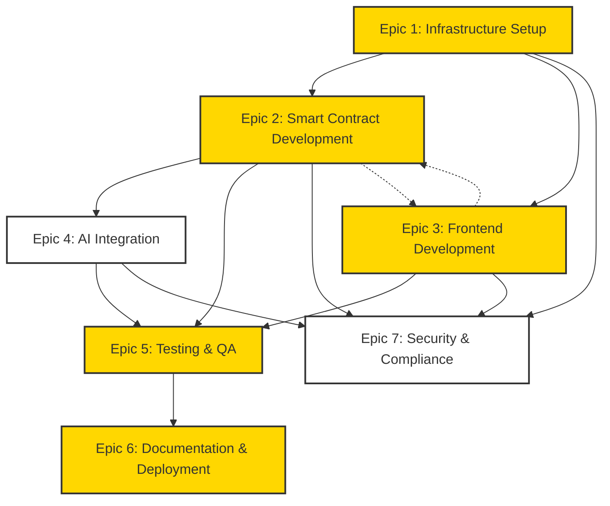

# OVT Development Backlog

## Status & Priority Legend
- Status: 🔴 Not Started | 🟡 In Progress | 🟢 Completed | ⭕ Blocked | 🔵 In Review
- Priority: 🏃‍♂️ P0 (Critical) | 🚶‍♂️ P1 (High) | 🧍‍♂️ P2 (Medium) | 🪑 P3 (Low)

## Dependency Graph

## Epic 1: Infrastructure Setup 🟡
Foundation for development environment and tooling.

### Tasks
1. 🟢 Install and configure development prerequisites 🏃‍♂️
   - [x] Solana CLI (v1.17.16)
   - [x] Node.js (v22.11.0)
   - [x] Rust and Cargo
   - [x] Docker and WSL2

2. 🟡 Set up development environment 🏃‍♂️
   - [x] Configure project structure
   - [x] Initialize Git repository
   - [ ] Set up CI/CD pipeline
   - [ ] Configure testing environment

3. 🔴 Configure Arch Network tools 🏃‍♂️
   - [ ] Set up local validator
   - [ ] Configure testnet connection
   - [ ] Implement deployment scripts

## Epic 2: Smart Contract Development 🟡
Core OVT program implementation on Arch Network.

### Tasks
1. 🟡 Core OVT Program Structure 🏃‍♂️
   - [x] Set up program modules
   - [x] Implement error handling
   - [x] Add program state management
   - [x] Implement instruction processing
   - [x] Add transaction verification logic
   - [x] Implement proof validation system

2. 🟡 NAV Calculation System 🏃‍♂️
   - [x] Implement price feed integration
   - [x] Create NAV calculation logic
   - [x] Add SAFE valuation logic
   - [ ] Implement treasury tracking

3. 🟡 Token Operations 🚶‍♂️
   - [x] Implement OVT minting with 3/5 multisig
   - [x] Add transfer functionality
   - [x] Create buyback mechanism
   - [x] Implement burn functionality

4. 🟡 RPC Client Features 🏃‍♂️
   - [x] Implement transaction history & indexing
   - [x] Add fee estimation & UTXO management
   - [x] Add network status & health monitoring
   - [x] Implement event subscription system
   - [x] Add caching layer with TTL
   - [x] Implement rate limiting
   - [x] Add retry logic with backoff
   - [x] Enforce "OTORI VISION TOKEN" symbol
   - [ ] Add performance monitoring
     - [ ] Request latency tracking
     - [ ] Cache hit ratio monitoring
     - [ ] Rate limit violation tracking
   - [ ] Optimize caching strategy
     - [ ] Implement cache invalidation
     - [ ] Add cache warming
     - [ ] Create cache size limits
   - [ ] Enhance error handling
     - [ ] Add detailed error reporting
     - [ ] Implement circuit breaker
     - [ ] Create error recovery strategies

5. ⭕ Oracle Integration 🚶‍♂️
   - [ ] Set up price feed oracles
   - [ ] Implement data validation
   - [ ] Add fallback mechanisms
   - [ ] Create update mechanisms

## Epic 3: Frontend Development 🟡
User interface and interaction layer.

### Tasks
1. 🟢 Project Setup 🏃‍♂️
   - [x] Initialize Next.js project
   - [x] Configure TypeScript
   - [x] Set up Tailwind CSS
   - [x] Add required dependencies

2. 🟡 Core Components 🏃‍♂️
   - [x] Create NAV visualization
   - [x] Implement wallet connector
   - [x] Add portfolio view
   - [ ] Create transaction history

3. 🟡 State Management 🚶‍♂️
   - [x] Implement OVT state hooks
   - [x] Add wallet state management
   - [ ] Create transaction state handling
   - [ ] Implement error state management

4. �� Admin Dashboard 🏃‍♂️
   - [x] Create admin authentication with multisig
   - [x] Implement token minting interface
     - [x] Add multisig approval flow
     - [x] Implement "OTORI VISION TOKEN" validation
     - [x] Add minting amount validation
     - [x] Add minting reason field
   - [x] Create portfolio management interface
     - [x] Add post-TGE position entry form
       - [x] Amount bought input with BTC/USD selection
       - [x] Price per token input
       - [x] Currency spent input
       - [x] Transaction ID verification
     - [x] Add pre-TGE position entry form
       - [x] Amount bought input with BTC/USD selection
       - [x] Price per token input
       - [x] Currency spent input
       - [x] SAFE/SAFT inscription ID verification
     - [x] Add position exit form
       - [x] Amount sold input
       - [x] Price per token input
       - [x] Currency received input
       - [x] Transaction ID verification
   - [x] Implement position tracking
     - [x] Add position history view
     - [x] Create performance metrics
     - [x] Implement export functionality
   - [x] Frontend Integration 🚶‍♂️
     - [x] Create AdminDashboard component
     - [x] Update TokenExplorerModal
       - [x] Add position history view
       - [x] Add performance metrics
       - [x] Add export functionality
     - [x] Update NAVVisualization
       - [x] Add admin controls for position management
       - [x] Add multisig approval UI
     - [x] Create PositionManagement component
       - [x] Add forms for pre/post TGE positions
       - [x] Add position exit form
       - [x] Add position history view
     - [x] Create MultiSigApproval component
       - [x] Add wallet connection for admin keys
       - [x] Add signature collection UI
       - [x] Add transaction verification
     - [x] Add error handling and loading states
     - [x] Add responsive design for all new components
     - [x] Add admin wallet validation
     - [x] Create TokenMinting component
     - [x] Create TransactionHistory component
       - [x] Add transaction filtering
       - [x] Add status indicators
       - [x] Add explorer links
       - [x] Show signature progress
       - [x] Add proper currency display (BTC/USD for positions)

5. 🔴 Data Integration 🚶‍♂️
   - [ ] Connect to Arch Network
   - [ ] Implement real-time updates
   - [ ] Add transaction handling
   - [ ] Create error handling

## Epic 4: AI Integration 🔴
AI-driven portfolio management system.

### Tasks
1. 🔴 Model Infrastructure 🧍‍♂️
   - [ ] Set up AI model environment
   - [ ] Implement data processing pipeline
   - [ ] Create model versioning system
   - [ ] Add monitoring tools

2. 🔴 Portfolio Analysis 🧍‍♂️
   - [ ] Implement market trend analysis
   - [ ] Create risk assessment system
   - [ ] Add performance metrics
   - [ ] Implement decision validation

3. 🔴 Integration Layer 🚶‍♂️
   - [ ] Create API endpoints
   - [ ] Implement proof generation
   - [ ] Add verification system
   - [ ] Create fallback mechanisms

## Epic 5: Testing & Quality Assurance 🟡
Comprehensive testing strategy implementation.

### Tasks
1. 🟡 Unit Testing 🏃‍♂️
   - [x] Set up testing framework
   - [ ] Write smart contract tests
   - [ ] Create component tests
   - [ ] Implement state management tests

2. 🔴 Integration Testing 🚶‍♂️
   - [ ] Test wallet integration
   - [ ] Verify oracle connections
   - [ ] Test AI model integration
   - [ ] Validate transaction flow

3. 🔴 End-to-End Testing 🚶‍♂️
   - [ ] Create user journey tests
   - [ ] Test error scenarios
   - [ ] Validate state transitions
   - [ ] Test performance metrics

## Epic 6: Documentation & Deployment 🟡
Documentation and deployment procedures.

### Tasks
1. 🟡 Technical Documentation 🚶‍♂️
   - [x] Create README
   - [x] Add installation guide
   - [ ] Document API endpoints
   - [ ] Create troubleshooting guide

2. 🟡 User Documentation 🧍‍♂️
   - [x] Create user journey docs
   - [ ] Add feature guides
   - [ ] Create FAQ
   - [ ] Add tutorial videos

3. 🔴 Deployment Procedures 🏃‍♂️
   - [ ] Create deployment checklist
   - [ ] Document rollback procedures
   - [ ] Add monitoring setup
   - [ ] Create maintenance guide

## Epic 7: Security & Compliance 🔴
Security implementation and compliance measures.

### Tasks
1. 🔴 Security Implementation 🏃‍♂️
   - [ ] Implement input validation
   - [ ] Add transaction signing
   - [ ] Create access controls
   - [ ] Implement rate limiting

2. 🔴 Audit Preparation 🚶‍♂️
   - [ ] Document security measures
   - [ ] Create audit checklist
   - [ ] Prepare technical documentation
   - [ ] Set up security monitoring

3. 🔴 Compliance Framework 🧍‍♂️
   - [ ] Document regulatory requirements
   - [ ] Implement KYC/AML checks
   - [ ] Create compliance reports
   - [ ] Add audit logging

## Notes
- This backlog is automatically updated as tasks are completed
- Priority may shift based on Arch Network development status
- Tasks may be added or modified based on technical requirements
- Dependencies between epics should be considered when planning

## Task Update Process
1. Update task status using emoji indicators
2. Add new tasks as needed under appropriate epics
3. Document completion dates for major milestones
4. Track dependencies and blockers

## Priority Guidelines
- 🏃‍♂️ P0 (Critical): Blocking tasks that must be completed for core functionality
- 🚶‍♂️ P1 (High): Important features needed for MVP
- 🧍‍♂️ P2 (Medium): Nice-to-have features that improve UX
- 🪑 P3 (Low): Future enhancements and optimizations 